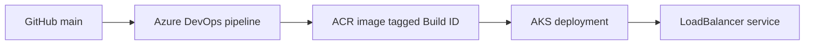

# Azure AKS DevOps Platform

A small .NET 8 API used to practise an end-to-end deployment: a push to `main` builds a container in Azure DevOps, pushes it to Azure Container Registry (ACR), and deploys the same build to Azure Kubernetes Service (AKS).



## What is in the repo

| Path | Purpose |
| --- | --- |
| `app/DevOpsDemoApi/` | Minimal API with `/`, `/health`, `/ready`, and `/info` |
| `Dockerfile` | Multi-stage .NET build; non-root runtime on port 8080 |
| `ci.yml` | Build, push, deploy, and verify pipeline |
| `k8s/` | Deployment with probes/resources and a public LoadBalancer service |
| `terraform/` | Terraform configuration for the lab resource group, ACR, pull role, and imported AKS cluster |

The pipeline uses the `ACRAuthTF` registry connection and `AzureSC` Azure service connection. Pull request validation builds the image without publishing it. A run from `main` pushes `jaidevopstflabacr.azurecr.io/devops-demo:<Build.BuildId>`, updates `:latest`, and deploys the Build ID image. `KubernetesManifest@1` substitutes that image into the Deployment manifest, checks rollout stability, and the following step checks the deployment's image and calls the public `/health` endpoint. The manifest's `:latest` value is a substitution placeholder; deployment verification rejects `:latest` as the final image. A failed health check fails the pipeline.

## Run locally

From `app/DevOpsDemoApi`, run `dotnet run`; or build and run the container from the repo root:

```bash
docker build -t devops-demo-api:local .
docker run --rm -p 127.0.0.1:8080:8080 devops-demo-api:local
curl http://localhost:8080/health
```

The API listens on port 8080. `/health` and `/ready` return simple success responses; they do not check external dependencies because this demo has none.

## Verify an Azure deployment

After a successful pipeline run, its final step prints the deployed image and public health URL. From an authenticated Azure CLI session, you can also inspect the cluster directly:

```bash
az aks get-credentials --resource-group rg-devops-e2e --name jaidevopsaks --overwrite-existing
kubectl rollout status deployment/devops-demo --namespace default --timeout=180s
kubectl get deployment devops-demo --namespace default -o jsonpath='{.spec.template.spec.containers[0].image}'
kubectl get pods -l app=devops-demo --namespace default -o wide
kubectl get service devops-demo-service --namespace default -o wide
```

Use the LoadBalancer `EXTERNAL-IP` from the last command at `http://<EXTERNAL-IP>/health`. A successful pipeline run verifies the image for **that run**, so an older run's tag (for example `:11`) is not assumed to be the image currently running. Save a screenshot of the successful pipeline and the `kubectl` output for a portfolio walkthrough after verifying them.

## Terraform and the imported cluster

The lab resource group `rg-resource-tf-lab` and ACR `jaidevopstflabacr` were created with Terraform. A separate AKS creation attempt was blocked by Central India regional vCPU quota; the existing `jaidevopsaks` cluster in `rg-devops-e2e` was imported instead. Terraform state is local and excluded from Git, so a fresh checkout **does not** already manage the cluster.

The imported AKS configuration has not yet been proven to produce a safe plan against live Azure state. `prevent_destroy` blocks replacement of the AKS resource, but it does not make proposed in-place changes safe or resolve differences between configuration and state. From the machine holding the imported state:

```bash
cd terraform
terraform init
terraform state list
terraform plan -out=review.tfplan
terraform show review.tfplan
```

Review every AKS and node-pool difference, especially network settings, before applying any plan. Do not apply a plan that proposes cluster replacement. If using a fresh checkout, import the existing resources into that checkout's state deliberately before managing them; never commit state or credentials. The ACR pull role assignment also needs to be checked against live state to avoid a duplicate assignment.

## Troubleshooting notes

- If the pod cannot pull the image, inspect `kubectl describe pod` and confirm the AKS kubelet identity has `AcrPull` on the ACR.
- If the deployment does not become ready, inspect `kubectl get pods`, `kubectl describe pod`, and `kubectl logs deployment/devops-demo`; the probes call port 8080.
- If the LoadBalancer has no external IP, inspect `kubectl describe service devops-demo-service` and Azure quota/network configuration. The pipeline's endpoint check will fail with service details.
- If Terraform proposes to replace AKS, stop and compare live AKS settings with the configuration and imported state. The `prevent_destroy` guard blocks accidental replacement.

## Background

I started this project to practise Docker, CI/CD, AKS, troubleshooting, and Terraform on a small application. Early mistakes with Docker `COPY`, build context, and command syntax helped clarify the difference between source files, images, and running containers. The remaining live proof is a successful pipeline run with its public health check and a reviewed, non-destructive Terraform plan.
